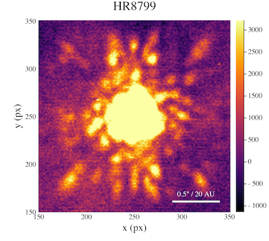

# Introduction to High-Contrast Imaging

This will serve as a brief primer to high-contrast imaging (HCI) to illustrate the concepts and themes prevalent within this package. This is not meant to be an exhaustive lecture note on the topic, but more of a gentle introduction.

If you are comfortable with HCI topics, consider skipping to the [Getting Started](@ref gettingstarted) section to get introduced to ADI.jl, browse the Examples to see sample workflows, or browse through the API to start exploring the capabilities of ADI.jl.

## What is HCI

HCI is an advanced imaging technique comprising modern instrumentation, clever observational techniques, and post-processing algorithms. The goal of HCI is to probe the circumstellar regions of a star in the search for companions, debris disks, and more. The use of large aperture telescopes, adaptive optics (AO), and coronagraphs are the basis of HCI. An example of an image taken with these instruments is shown below.

What is notable in this image is that there is a lot of structured noise in the image that is overwhelming any potential companion signal. The center of the image is particularly noisy, which is precisely where we are most interested in searching for exoplanets. This noise is the effect of quasi-static speckles in the focal-plane. These speckles occur from non-common path aberrations in the AO system and are a fundamental part of the data received by these instruments. Improving the quality of instrumentation is an active topic of HCI research, but it is beyond the scope of this introduction.

## [Angular Differential Imaging (ADI)](@id adi)

Because this noise is fundamental to the data, post-processing must be performed in order to see any circumstellar signal. This post-processing requires us to fit the PSF of the speckles and then remove it. An example of the above frame with the speckles removed is shown below.

Unfortunately, there is no companion evident; but the speckles have been removed, so what is left? The exoplanet is still sitting below the statistical noise in this frame, but the noise can be averaged out by combining many frames together. Since we are concerned with subtracting the speckles, we need to be careful and consider **how do we fit and subtract the speckles without removing potential companion signal**?

This is where angular differential imaging (ADI) comes in. ADI is an observational technique pioneered in the early 2000s as an extension of *roll deconvolution* for ground-based telescopes. The core of this process is that the quasi-static speckles are a function of the optical system, not the astrophysical source. Throughout a night of observing we can leverage the rotation of the Earth to make the field-of-view (FOV) appear to rotate (on an Alt-Az mounted telescope with the field rotator disabled). Even though the sky appears to rotate, because the speckles are due to the telescope optics they will not appear to rotate. The animation below shows a cube of data with a bright fake companion that illustrates the sky rotation typical of ADI.

By taking this sequence of images (commonly referred to as a cube) we can more easily model and fit the speckle signal separate from any companions. If you median combine the cube as-is, the non-stationary companion signal will attenuate leaving just the speckles. If we derotate the sequence according to the parallactic angles for each frame we align the sky to a common heading. Now we can collapse the derotated sequence and the planet will constructively interfere while the now-rotating speckles will attenuate. The figure below shows these two competing reductions.

## Post-Processing Algorithms

Using data cubes (as described in the [ADI section](@ref adi)), we are tasked with fitting the speckles without capturing the rotating companion signal. Quite a few algorithms have been proposed and a thorough discussion of them is beyond the scope of this introduction. For now, let's assume the algorithms are a black-box that produce speckle approximation cubes.

If we have this cube, all we need to post-process the data is

1. Retrieve a speckle estimate cube
2. Subtract the speckle estimate from the target cube and form a residual cube
3. Derotate the residual cube according to the parallactic angles of the target
4. Collapse the derotated residual cube

Steps 2-4 are shown in the following figure

After all this processing, finally the substellar companion HR8799e is evident. Hopefully this shows the difficulty of HCI and builds up part of the process that occurs outside of the reduction you'll be doing with ADI.jl.

## References

Here is a selection of further reading for information about high-contrast imaging, ADI, and similar techniques

* [Traub, Oppenheimer 2010, "Direct Imaging of Exoplanets"](https://www.google.com/url?sa=t&rct=j&q=&esrc=s&source=web&cd=&ved=2ahUKEwj4rKn8_a3tAhVpvFkKHcepDoEQFjAKegQIBRAC&url=https%3A%2F%2Fwww.amnh.org%2Fcontent%2Fdownload%2F53052%2F796511%2Ffile%2FDirectImagingChapter.pdf&usg=AOvVaw0JT9cGTkuFGknAsfvyMxkY) (note: will download a PDF)
* [Bowler 2016, "Imaging Extrasolar Giant Planets"](https://ui.adsabs.harvard.edu/abs/2016PASP..128j2001B/abstract)
* [Pueyo 2018, "Direct Imaging as a Detection Technique for Exoplanets"](https://link.springer.com/referenceworkentry/10.1007%2F978-3-319-55333-7_10)
* [Marois et al. 2006, "Angular Differential Imaging: A Powerful High-Contrast Imaging Technique](https://ui.adsabs.harvard.edu/abs/2006ApJ...641..556M/abstract)
